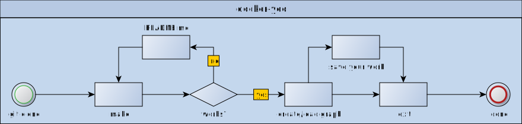

# docker-yed

Install and run yEd in a Docker container.




# Table of Contents

- [Quick Start](#quick-start)
  - [Build and Start](#build-and-start)
  - [Workspace](#workspace)
  - [Bash Alias](#bash-alias)
  - [Installer Options](#using-yed)
- [FAQ and Common Problems](#faq-and-common-problems)
  - [What is yEd?](#what-is-yed)
  - [Installation Loop](#installation-loop)
  - [Got Permission Denied](#got-permission-denied)
  - [Remove Container](#remove-container)
  - [Generic Docker Issues](#generic-docker-issues)
    - [Other X11 and Wayland Problems](#other-x11-and-wayland-problems)

# Quick Start

## Build and Start

Just run `make`, this will build and start the container.
After building the yEd installer should pop up.
Accept the agreement and use the default values and paths.

Use `yed` inside the container to install and/or start yEd, if yEd didn't start automatically.

Press `CTRL+D` or use `exit` to shut down the container.

## Workspace

- Inside the container: You can save your work in `/home/yed/workspace`
- Outside the container: You can access your work in `${GIT-PATH}/docker-yed/workspace`

You can specify your own custom workspace directory by passing WORKSPACE=$DIRECTORY as an argument.

Example: `make WORKSPACE=/opt`

## Bash Alias

Put this in your .bashrc (or elsewhere) to start the container and yEd:

Default workspace:

```bash
alias yed='make -C ${GIT-PATH}/docker-yed'
```

Custom workspace:

```bash
alias yed='make -C ${GIT-PATH}/docker-yed WORKSPACE=${OWN_WORKSPACE_PATH}'
```

## Installer Options

To install yEd simply run `yed-install` inside the container, if the installer didn't pop up or you closed it.

Recommendation: Just leave the default values as they are:

- Agreement: `I accept the agreement` (this is not default)
- Destination directory: `/home/yed/yEd`
- Create symlinks: `/usr/local/bin`
- Create a desktop icon: `Yes` (don't care)
- Run yEd Graph Editor: `Yes` (don't care)

You can now run yEd directly from the installer or just run `yed-run` inside the container shell.

```bash
yed-install    # install yed
yed-run        # run yed
```

# FAQ and Common Problems

## What is yEd?

It's a cross-platform application (Linux, Windows, and Mac OS) that can be used to draw diagrams.

You can export diagrams as GIF, JPEG, PNG, EMF, BMP, PDF, EPS, and SVG.

- [Official yEd website](https://www.yworks.com/products/yed)
- [Gallery of user-created diagrams](https://www.yworks.com/products/yed/gallery)

## Installation Loop

You need to install yEd every time you run the container because the installer script doesn't provide a command line interface.

## Got Permission Denied

Error:

```
Got permission denied while trying to connect to the Docker daemon socket at ...:
Post ...: dial ...: connect: permission denied
```

Solution (add your user to docker group):

```bash
sudo groupadd docker
sudo usermod -aG docker ${USER}
su -s ${USER}
```

## Docker is not running

Error:

```
ERROR: Cannot connect to the Docker daemon at unix:///var/run/docker.sock.
Is the docker daemon running?
```

Solution (start docker service):

```bash
sudo systemctl start docker
sudo systemctl enable docker    # optional, docker will now start automatically
```

## Remove Container

List docker-yed container(s):

```bash
docker images | grep docker-yed    # list containers, we only care about docker-yed container(s)
```

Remove container(s):

```bash
docker image rm docker-yed    # by name
docker image rm ${ID}         # by ID, alternative option
```

Stop container(s):

```bash
docker container stop ${ID}
```

## Generic Docker Issues

### Other X11 and Wayland Problems

Please check this link: https://github.com/mviereck/x11docker
